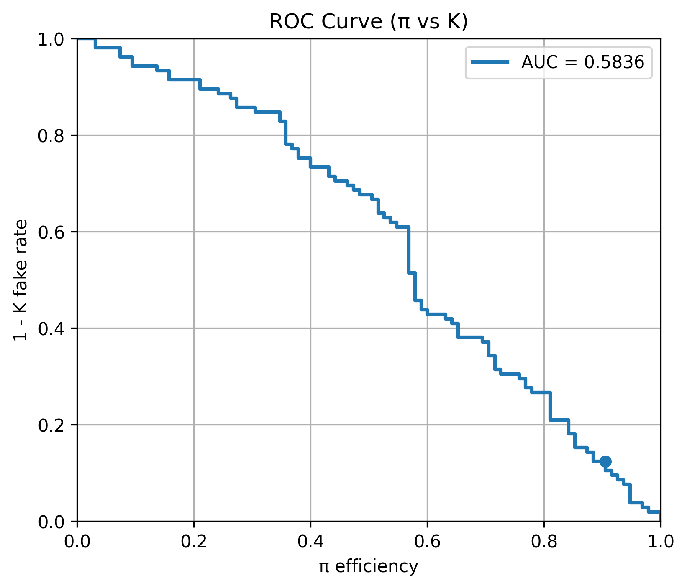
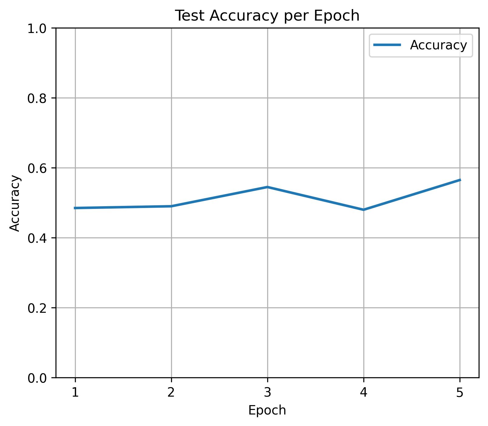

# gnn-particle-identification
Research project on particle identification using Graph Neural Networks (GNN), focusing on K/π classification with Cherenkov detector simulation data.

## Overview
This project focuses on particle identification using Graph Neural Networks (GNN).  
The goal is to classify charged particles (Kaon / Pion) based on simulated Cherenkov detector data.
This repository contains a simplified demonstration pipeline using dummy/simulated data for reproducibility and public sharing.

## Background
In high energy physics experiments such as TOP counter systems, distinguishing between particles like kaons and pions is an important task.  
This project explores the application of GNNs to improve classification performance.

## Method
- Graph construction from photon detection events
- Node features:
  - Momentum
  - Hit positions (x, z)
  - Detection channel (x, y)
  - Detection time
- k-nearest neighbor (k-NN) graph
- Model: Graph Neural Network (PyTorch)

## Repository Structure

- src/         : source code
- notebooks/   : experiment notebooks
- results/     : output figures

Main experiments and demonstrations are provided in:

notebooks/experiment.ipynb

## Example Results

### ROC Curve

### Test Accuracy

## Key Contributions
- Investigated impact of feature normalization
- Improved performance by optimizing graph structure (k-NN vs fully connected)
- Analyzed factors affecting classification accuracy
- Achieved misidentification rate of 0.2% (target: <1%)

## Tech Stack
- Python
- PyTorch
- PyTorch Geometric
- NumPy

## Requirements

- Python 3.10+
- PyTorch
- PyTorch Geometric
- NumPy
- uproot
- awkward

Install dependencies with:

pip install -r requirements.txt

## Status
Work in progress (research project)

## Future Work
- Feature engineering improvements
- Hyperparameter optimization
- Application to real experimental data
